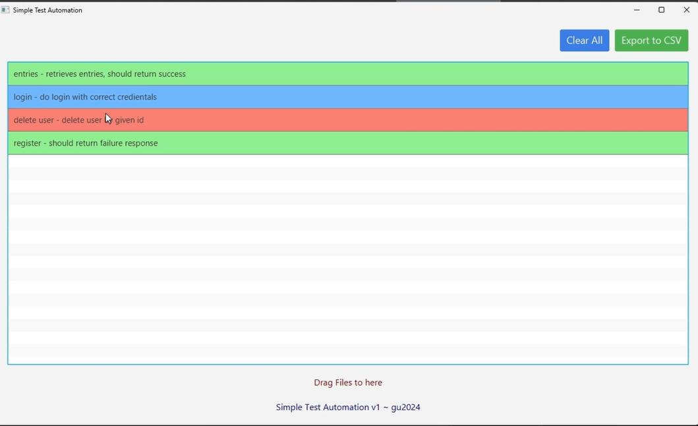
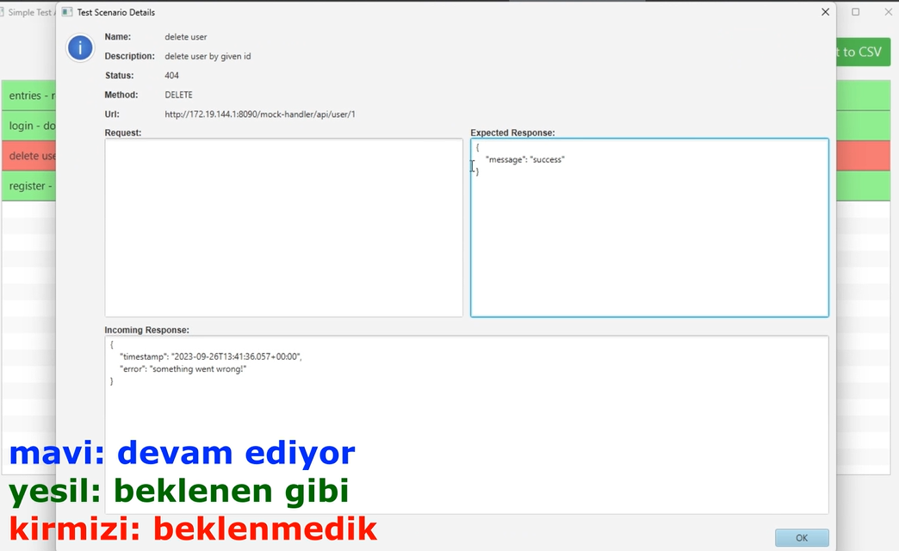

# Simple Api Testing Automation





### Video: [https://youtu.be/PJnjK9oGhC8](https://youtu.be/PJnjK9oGhC8)

[https://gluonhq.com/products/javafx/](https://gluonhq.com/products/javafx/)

```shell
mvn clean compile assembly:single 
# java --module-path C:/Users/User/Downloads/openjfx-17.0.9_windows-x64_bin-sdk/javafx-sdk-17.0.9/lib --add-modules javafx.controls,javafx.fxml -jar target/apiTestAutomation-1.0-SNAPSHOT-jar-with-dependencies.jar
#java --module-path C:/Users/User/Downloads/openjfx-17.0.9_windows-x64_bin-sdk/javafx-sdk-17.0.9/lib --add-modules javafx.controls,javafx.fxml -jar ./res/build.jar
java --module-path path/javafx-sdk-17.0.9/lib --add-modules javafx.controls,javafx.fxml -jar target/app-jar-with-dependencies.jar
```